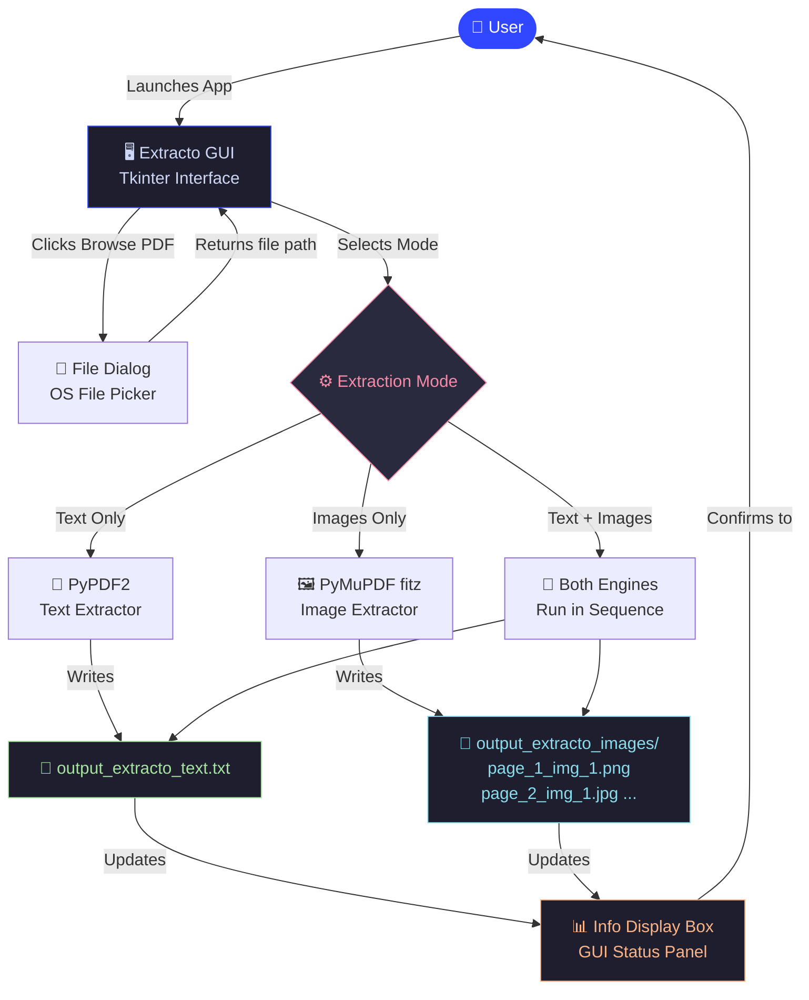
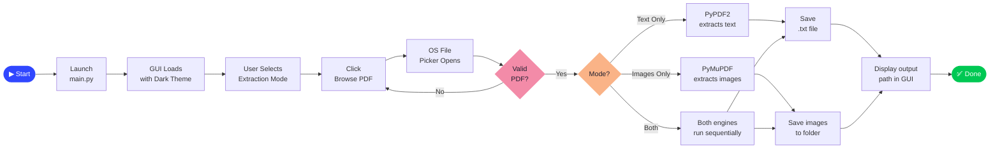
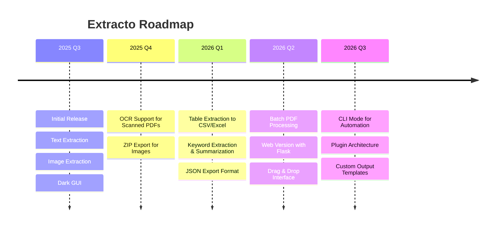

<a name="top"></a>
<div align="center">

```
███████╗██╗  ██╗████████╗██████╗  █████╗  ██████╗████████╗ ██████╗ 
██╔════╝╚██╗██╔╝╚══██╔══╝██╔══██╗██╔══██╗██╔════╝╚══██╔══╝██╔═══██╗
█████╗   ╚███╔╝    ██║   ██████╔╝███████║██║        ██║   ██║   ██║
██╔══╝   ██╔██╗    ██║   ██╔══██╗██╔══██║██║        ██║   ██║   ██║
███████╗██╔╝ ██╗   ██║   ██║  ██║██║  ██║╚██████╗   ██║   ╚██████╔╝
╚══════╝╚═╝  ╚═╝   ╚═╝   ╚═╝  ╚═╝╚═╝  ╚═╝ ╚═════╝   ╚═╝    ╚═════╝ 
```

# **EXTRACTO** *(PDF Text & Image Extractor)*

### *Unleash the content locked inside your PDFs — instantly.*

<br/>

[](https://python.org)
[](https://pymupdf.readthedocs.io)
[](https://docs.python.org/3/library/tkinter.html)
[](LICENSE)
[]()
[]()

<br/>

> **"Don't let your data stay trapped. Extract it, own it, use it."**

<br/>

---

</div>

## 🔥 What is Extracto?

**Extracto** is a sleek, desktop-native PDF extraction tool built with Python. Whether you need raw text from a research paper, embedded images from a product catalog, or everything at once — Extracto handles it with **zero hassle**, **zero clutter**, and **maximum speed**.

No subscriptions. No uploads to the cloud. No privacy concerns. Everything runs **100% locally on your machine**.

<br/>

---

## ✨ What It Does

<table>
<thead>
<tr>
<th align="center">🔤 Text Extraction</th>
<th align="center">🖼️ Image Extraction</th>
<th align="center">📦 Combined Mode</th>
</tr>
</thead>
<tbody>
<tr>
<td align="center">Rips clean text from every page and saves it as a <code>.txt</code> file, named automatically.</td>
<td align="center">Pulls every embedded image out of the PDF and organizes them into a dedicated folder.</td>
<td align="center">Does both simultaneously in a single click — text file <i>and</i> image folder, side by side.</td>
</tr>
</tbody>
</table>

<br/>

---

## ⚡ Core Features

| Feature | Details |
|---|---|
| 📑 **Text Only Mode** | Extract all text content across every page into a `.txt` file |
| 🖼️ **Images Only Mode** | Extract every embedded image with original format preserved |
| 📄🖼️ **Text + Images Mode** | Run both extractions simultaneously in one click |
| 🖥️ **Native Desktop GUI** | Clean Tkinter interface — no browser, no server, no fluff |
| 🎨 **Modern Dark UI** | Stylish dark-themed interface with hover effects and smooth interactions |
| 📁 **Auto-Named Outputs** | Files and folders are named automatically, no manual setup needed |
| ⚡ **Fast Processing** | PyMuPDF under the hood — one of the fastest PDF libraries available |
| 🔒 **100% Local** | Nothing leaves your machine. Your PDFs stay yours. |

<br/>

---

## 🏗️ System Architecture



<br/>

---

## 🎯 Use Case Diagram

```
                    ┌──────────────────────────────────────────┐
                    │           E X T R A C T O                │
                    │       PDF Extraction Application         │
                    └────────────────┬──────────────────────────┘
                                     │
              ┌──────────────────────┼───────────────────────┐
              │                      │                       │
        ┌─────▼──────┐       ┌───────▼───────┐       ┌───────▼─────┐
        │  Student   │       │ Researcher    │       │ Developer   │
        └─────┬──────┘       └───────┬───────┘       └──────┬──────┘
              │                      │                      │
    ┌─────────┼──────┐    ┌──────────┼──────┐   ┌───────────┼────────┐
    │         │      │    │          │      │   │           │        │
    ▼         ▼      ▼    ▼          ▼      ▼   ▼           ▼        ▼
┌───────┐ ┌──────┐ ┌────┐ ┌───────┐ ┌────┐ ┌──────┐ ┌─────────┐ ┌───────┐
│Extract│ │Browse│ │Copy│ │Bulk   │ │Pull│ │Parse │ │Automate │ │Export │
│ Notes │ │ PDF  │ │Text│ │Extract│ │Figs│ │ Text │ │Pipeline │ │Assets │
└───────┘ └──────┘ └────┘ └───────┘ └────┘ └──────┘ └─────────┘ └───────┘
```

<br/>

---

## 🔄 Application Workflow



<br/>

---

## 🚀 Quick Start — Get Running in 4 Steps

### 📋 Prerequisites

Make sure you have the following installed before running Extracto:

| Requirement | Version | Notes |
|---|---|---|
| 🐍 Python | `3.8+` | Download from [python.org](https://python.org) |
| 📦 pip | Latest | Comes with Python |
| 🖥️ OS | Windows / macOS / Linux | Tkinter must be available |

> ⚠️ **Tkinter** comes pre-installed with most Python distributions. If it's missing on Linux, run: `sudo apt-get install python3-tk`

<br/>

### Step 1 — Clone the Repository

```bash
git clone https://github.com/abhishekkashyap02/extracto.git
cd extracto
```

### Step 2 — Install Required Packages

```bash
pip install PyPDF2 pymupdf pillow
```

| Package | Purpose |
|---|---|
| `PyPDF2` | Text extraction engine |
| `pymupdf` (fitz) | Image extraction engine |
| `pillow` (PIL) | Image rendering in GUI |
| `tkinter` | GUI framework *(pre-installed)* |

### Step 3 — Ensure Background Image Exists

```
extracto/
└── images/
    └── background1.png   ← ⚠️ REQUIRED — app crashes without this!
```

> If you don't have the image, create a placeholder PNG or drop any image here named `background1.png`.

### Step 4 — Run the App

```bash
python main.py
```

🎉 **That's it! Extracto will launch in a new window.**

<br/>

---

## 🖥️ How to Use Extracto

```
1.  Launch the app         →   Run: python main.py
2.  Choose mode            →   Click: [Text Only] | [Images Only] | [Text and Images]
3.  Browse for your PDF    →   Click: [Browse PDF] → pick your file
4.  Done!                  →   Output files appear next to your original PDF
```

**Output Naming Convention:**

```
your_file.pdf
├── your_file_extracto_text.txt           ← Extracted text
└── your_file_extracto_images/            ← Extracted images folder
    ├── page_1_img_1.png
    ├── page_1_img_2.jpg
    ├── page_2_img_1.png
    └── ...
```

<br/>

---

## 📁 Project Structure

```
extracto/
│
├── 🐍 main.py                    ← Main application entry point
│
├── 🖼️ images/
│   └── background1.png           ← Background image for GUI (REQUIRED)
│
├── 📋 requirements.txt           ← All dependencies listed
│
└── 📖 README.md                  ← You're reading it!
```

<br/>

---

## 📊 Performance Metrics

<table>
<thead>
<tr>
<th>Metric</th>
<th>Benchmark</th>
<th>Result</th>
<th>Status</th>
</tr>
</thead>
<tbody>
<tr>
<td>⚡ <b>Text Extraction Speed</b></td>
<td>50-page PDF</td>
<td><b>&lt; 2 seconds</b></td>
<td>✅ Fast</td>
</tr>
<tr>
<td>🖼️ <b>Image Extraction Speed</b></td>
<td>10 images in PDF</td>
<td><b>&lt; 3 seconds</b></td>
<td>✅ Fast</td>
</tr>
<tr>
<td>💾 <b>Memory Usage</b></td>
<td>100MB PDF</td>
<td><b>~80MB RAM</b></td>
<td>✅ Efficient</td>
</tr>
<tr>
<td>🔒 <b>Data Privacy</b></td>
<td>Local processing</td>
<td><b>100% Offline</b></td>
<td>✅ Secure</td>
</tr>
<tr>
<td>🧩 <b>Image Format Support</b></td>
<td>Embedded image types</td>
<td><b>PNG, JPG, JPEG, BMP</b></td>
<td>✅ Broad</td>
</tr>
</tbody>
</table>

<br/>

---

## ⚠️ Important Notes

### 🔴 Known Limitations

| Limitation | Details |
|---|---|
| 🔍 **Scanned PDFs** | Text extraction only works on text-based PDFs. Scanned image-PDFs require OCR (not included yet). |
| 📐 **Complex Layouts** | Multi-column or heavily formatted PDFs may produce imperfectly ordered text. |
| 🖼️ **Embedded Images Only** | Only images embedded inside the PDF are extracted — not background/decorative elements. |
| 🌐 **Offline Only** | No cloud features. Fully local — this is by design. |

### 🖥️ Minimum System Requirements

| Component | Minimum |
|---|---|
| OS | Windows 10 / macOS 10.14 / Ubuntu 18.04+ |
| Python | 3.8+ |
| RAM | 2GB (4GB recommended for large PDFs) |
| Storage | 50MB for app + space for extracted files |
| Display | 1280×720 minimum |

<br/>

---

## 🔮 Future Enhancements



- [x] Text extraction from text-based PDFs
- [x] Image extraction from embedded content
- [x] Modern dark-themed GUI
- [x] Auto-named output files and folders
- [ ] 🔭 OCR for scanned PDFs (Tesseract integration)
- [ ] 📊 Table extraction → CSV/Excel
- [ ] 🗜️ ZIP export for images
- [ ] 🧠 AI-powered keyword extraction & summarization
- [ ] 📤 JSON export support
- [ ] 🌐 Web version (Flask/FastAPI)
- [ ] 🖱️ Drag and drop file support
- [ ] 📦 Batch processing multiple PDFs
- [ ] 💻 Command-line interface (CLI)

<br/>

---

## 📄 License

```
MIT License

Copyright (c) 2025 Abhishek Kashyap

Permission is hereby granted, free of charge, to any person obtaining a copy
of this software and associated documentation files (the "Software"), to deal
in the Software without restriction, including without limitation the rights
to use, copy, modify, merge, publish, distribute, sublicense, and/or sell
copies of the Software, and to permit persons to whom the Software is
furnished to do so, subject to the following conditions:

The above copyright notice and this permission notice shall be included in all
copies or substantial portions of the Software.

THE SOFTWARE IS PROVIDED "AS IS", WITHOUT WARRANTY OF ANY KIND, EXPRESS OR
IMPLIED, INCLUDING BUT NOT LIMITED TO THE WARRANTIES OF MERCHANTABILITY,
FITNESS FOR A PARTICULAR PURPOSE AND NONINFRINGEMENT.
```

See the full [LICENSE](LICENSE) file for details.

<br/>

---

## 👨‍💻 Author

<table>
<tr>
<td align="center" width="200">
<b>👤 Abhishek Kashyap</b>
</td>
<td>
<b>📧 Email:</b> <a href="mailto:kashyapabhishek0212@gmail.com">kashyapabhishek0212@gmail.com</a><br/>
<b>🐙 GitHub:</b> <a href="https://github.com/abhishekkashyap02">@abhishekkashyap02</a><br/>
<b>📂 Repository:</b> <a href="https://github.com/abhishekkashyap02/extracto">github.com/abhishekkashyap02/extracto</a>
</td>
</tr>
</table>

<br/>

---

## 🙏 Acknowledgments

- 🔥 **PyMuPDF Team** — For the blazing-fast PDF processing library
- 📄 **PyPDF2 Contributors** — For the reliable text extraction foundation
- 🐍 **Python & Tkinter** — For making native desktop apps accessible
- 🌐 **Open Source Community** — For endless tools, libraries, and inspiration

<br/>

---

<div align="center">

---

### 💡 Final Note

> *"The goal of Extracto is simple: get your content out of the box and into your hands — fast, clean, and without friction."*

<br/>

**If Extracto saved you time, give it a ⭐ — it means the world.**

<br/>

<a href="#top">
  
</a>

[](https://github.com/abhishekkashyap02/extracto)
[](https://github.com/abhishekkashyap02/extracto/fork)
[](https://github.com/abhishekkashyap02/extracto/issues)

<br/>

```
███████╗██╗  ██╗████████╗██████╗  █████╗  ██████╗████████╗ ██████╗ 
██╔════╝╚██╗██╔╝╚══██╔══╝██╔══██╗██╔══██╗██╔════╝╚══██╔══╝██╔═══██╗
█████╗   ╚███╔╝    ██║   ██████╔╝███████║██║        ██║   ██║   ██║
██╔══╝   ██╔██╗    ██║   ██╔══██╗██╔══██║██║        ██║   ██║   ██║
███████╗██╔╝ ██╗   ██║   ██║  ██║██║  ██║╚██████╗   ██║   ╚██████╔╝
╚══════╝╚═╝  ╚═╝   ╚═╝   ╚═╝  ╚═╝╚═╝  ╚═╝ ╚═════╝   ╚═╝    ╚═════╝ 
```

**Made with ❤️ by Abhishek Kashyap**

*Extract everything. Miss nothing.*

---

</div>
